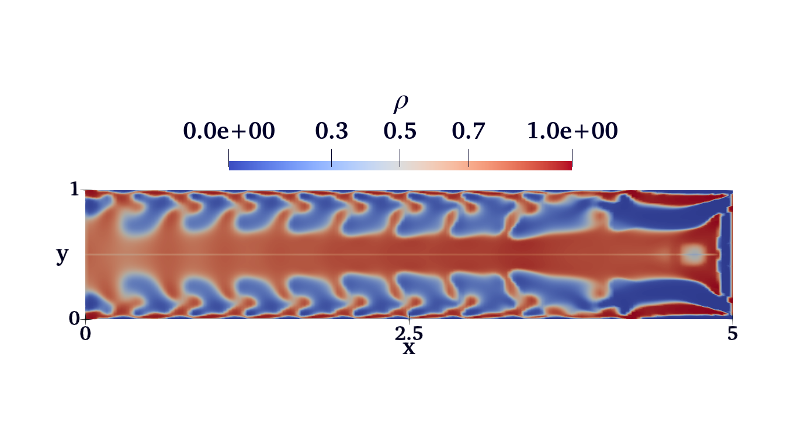

# Optimisation of Bone Screws using Topology Optimisation
This repository presents the code base developed during my master's project at Imperial College London to develop topologically optimised bone screws. 
The code developed here has its backbone in the Python finite element solver FIREDRAKE for solving the forward problem and 
the Python interface of IPOPT, CYIPOPT, to solve a given optimisation problem.

To run the code, you are advised to install a working version of FIREDRAKE and CYIPOPT before attempting to run any codes given in the code base.

## Simulation Result

## Branches
Each branch shows a part of the development process used. The important ones are detailed below
1. facetNormals - The code in IDP.py creates an auxetic structure
2. symmetry - The code runs using a symmetric boundary condition along the center of the initial domain. Currently the best performing code.

